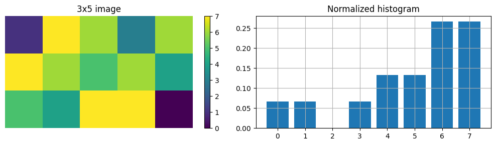
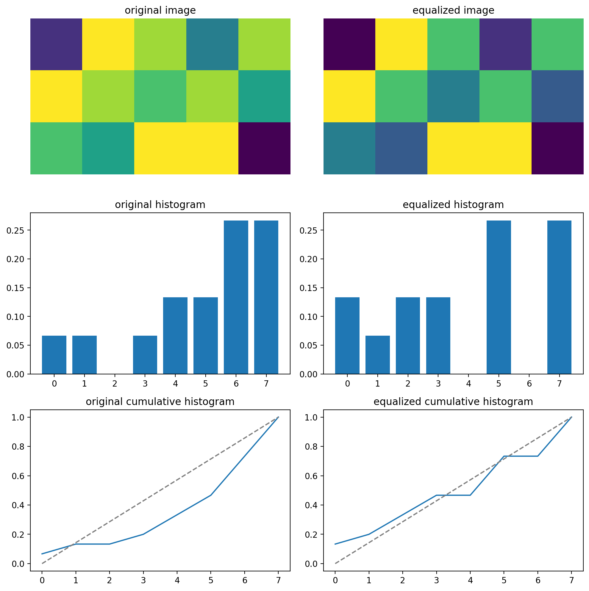

# Image Processing 1

- [Image Processing 1](#image-processing-1)
  - [Task 1](#task-1)
    - [Subtask a](#subtask-a)
    - [Subtask b](#subtask-b)
    - [Subtask c](#subtask-c)
    - [Subtask d](#subtask-d)
    - [Subtask e](#subtask-e)
    - [Subtask f](#subtask-f)
  - [Task 2](#task-2)
    - [Subtask a](#subtask-a-1)
    - [Subtask b](#subtask-b-1)
  - [Task 3](#task-3)
    - [Subtask a](#subtask-a-2)
    - [Subtask b](#subtask-b-2)
    - [Subtask c](#subtask-c-1)
    - [Subtask d](#subtask-d-1)
    - [Subtask e](#subtask-e-1)
  - [Task 4](#task-4)
    - [Subtask a](#subtask-a-3)
    - [Subtask b](#subtask-b-3)
    - [Subtask c](#subtask-c-2)
    - [Subtask d](#subtask-d-2)


## Task 1

### Subtask a

Sampling is the process of capturing a discrete amount of points (or samples) from the continuous voltage waveform at regular intervals.

### Subtask b

Quantization is the process of giving discrete numerical values to each of the sampled points to represent their amplitude.

### Subtask c


An image has high contrast if the histogram is well spread out across the entire range of possible values.

### Subtask d

First we have to define the image in python:

```python
image = np.array([[1,7,6,3,6],
                  [7,6,5,6,4],
                  [5,4,7,7,0]])
```

We can now calculate the noramlized histogram by hand by counting the number of pixels for each value between $0$ and $2^3-1=7$ and dividing by the total number of pixels in the image:

```python
n_pix = np.size(image)              # number of pixels
values_list = np.arange(0,2**3)     # value range
hist = np.zeros(np.size(values_list))
for k,value in enumerate(values_list):
    hist[k]=len(image[image == value])/n_pix
```



Now, we can use this histogram to compute the cumulative histogram and perform the pixel transformation in order to obtain an histogram-equalized version of the image:

```python
cum_hist = np.cumsum(hist)          # cumulated histogram
transform = np.floor(7*cum_hist)    # transformed values

# apply transformation
equalized_image = image.copy()
for value in values_list:
    equalized_image[equalized_image==value] = transform[value]
```

We get the following images:



### Subtask e

Wow true

### Subtask f

Wow true


## Task 2

### Subtask a

True!

### Subtask b

Misinformed!


## Task 3

### Subtask a

Truly amazing

### Subtask b

Truly amazing

### Subtask c

Truly amazing

### Subtask d

Truly amazing

### Subtask e

Truly amazing


## Task 4

### Subtask a

Truly amazing

### Subtask b

Truly amazing

### Subtask c

Truly amazing

### Subtask d

Truly amazing

<div style="break-after:page"></div>