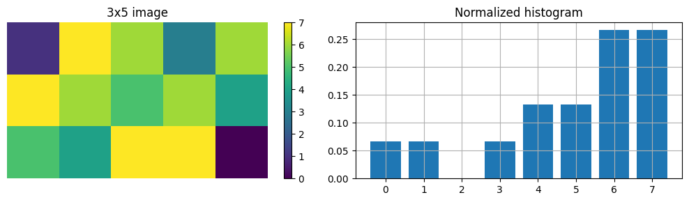
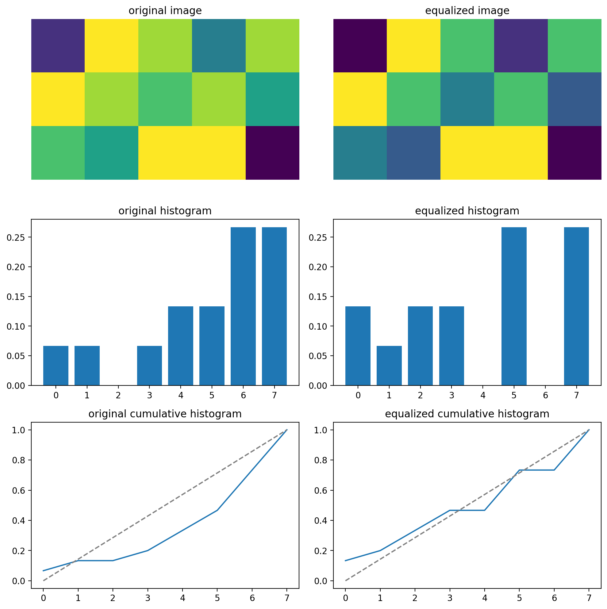
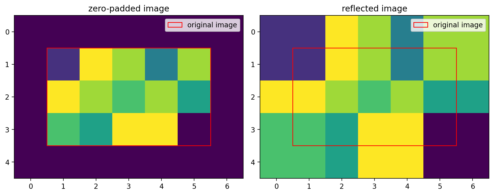
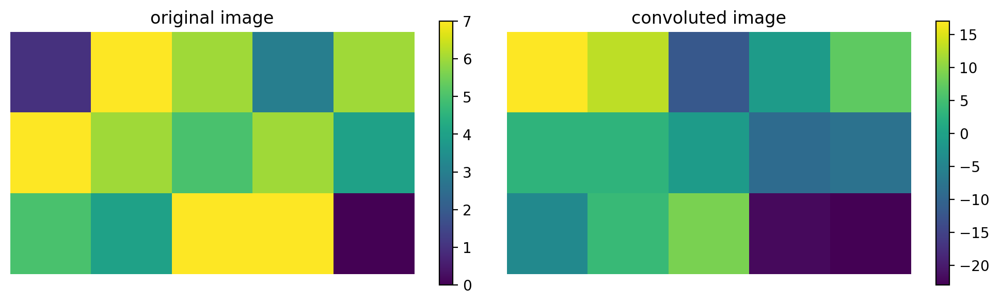
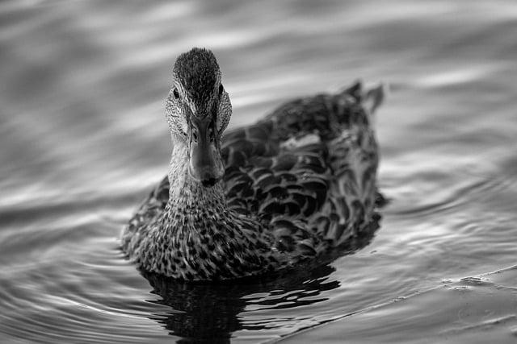
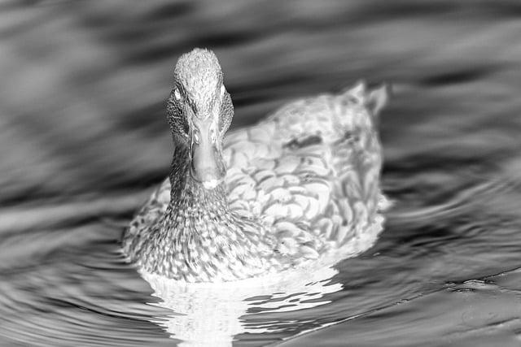
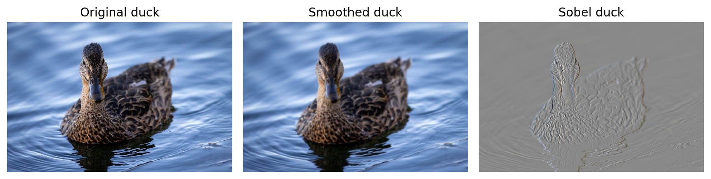

# Image Processing 1

- [Image Processing 1](#image-processing-1)
  - [Task 1](#task-1)
    - [Subtask a](#subtask-a)
    - [Subtask b](#subtask-b)
    - [Subtask c](#subtask-c)
    - [Subtask d](#subtask-d)
    - [Subtask e](#subtask-e)
    - [Subtask f](#subtask-f)
  - [Task 2](#task-2)
    - [Subtask a](#subtask-a-1)
    - [Subtask b](#subtask-b-1)
    - [Subtask c](#subtask-c-1)
  - [Task 3](#task-3)
    - [Subtask a](#subtask-a-2)
    - [Subtask b](#subtask-b-2)
    - [Subtask c](#subtask-c-2)
    - [Subtask d](#subtask-d-1)
    - [Subtask e](#subtask-e-1)
  - [Task 4](#task-4)
    - [Subtask a](#subtask-a-3)
    - [Subtask b](#subtask-b-3)
    - [Subtask c](#subtask-c-3)
    - [Subtask d](#subtask-d-2)


## Task 1

### Subtask a

Sampling is the process of capturing a discrete amount of points (or samples) from the continuous voltage waveform at regular intervals.

### Subtask b

Quantization is the process of giving discrete numerical values to each of the sampled points to represent their amplitude.

### Subtask c


An image has high contrast if the histogram is well spread out across the entire range of possible values.

### Subtask d

First we have to define the image in python:

```python
image = np.array([[1,7,6,3,6],
                  [7,6,5,6,4],
                  [5,4,7,7,0]])
```

We can now calculate the noramlized histogram by hand by counting the number of pixels for each value between $0$ and $2^3-1=7$ and dividing by the total number of pixels in the image:

```python
n_pix = np.size(image)              # number of pixels
values_list = np.arange(0,2**3)     # value range
hist = np.zeros(np.size(values_list))
for k,value in enumerate(values_list):
    hist[k]=len(image[image == value])/n_pix
```



Now, we can use this histogram to compute the cumulative histogram and perform the pixel transformation in order to obtain an histogram-equalized version of the image:

```python
cum_hist = np.cumsum(hist)          # cumulated histogram
transform = np.floor(7*cum_hist)    # transformed values

# apply transformation
equalized_image = image.copy()
for value in values_list:
    equalized_image[equalized_image==value] = transform[value]
```

We get the following images:



### Subtask e

When applying a log transform to an image with a large variance in pixel intensities, the dynamic range is compressed or reduced.

The log transform function, $s = c \cdot \log(1 + r)$, is a nonlinear transformation that enhances the lower-intensity values more than the higher-intensity values. This means that for higher-intensity pixels, the compression effect is more pronounced.

In other words:

- Low-intensity pixels are stretched out more by the logarithmic transformation.
- High-intensity pixels are compressed closer together.

### Subtask f

We perform spatial convolution by hand on the same image as **Subtask d**. The convolution kernel is shown below:
$$K_\text{Sobel} = \begin{bmatrix*}
  1&0&-1\\
  2&0&-2\\
  1&0&-1
\end{bmatrix*}$$

We will pad the image by reflecting the edges which is the image to the right in the picture below:



We can now perform the convolution operation by doing element wise multiplication + sum between the kernel and a subset of the image, then moving the kernel and doing it again. For this to be convolution (and not correlation) we have to flip the kernel in both directions:

```python
N,M = np.shape(image)       # image dimensions
n,m = np.shape(kernel)      # kernel dimensions

# perform convolution (flip the kernel in both directions)
for row in range (N):
    for column in range(M):
        convoluted_image[row,column] = np.sum(np.multiply(kernel[::-1,::-1], padded_image[row:row+n,column:column+m]))
```

The output (convolued) image is then:

$$\begin{bmatrix}
  17  &  13  &  -12 &  -1  &     7\\
  3   &   3  &  -1  &  -9  &  -8  \\
  -4  &   4  &  9   & -22  &   -23\\
\end{bmatrix}$$

We can plot the original and the convoluted images side by side to compare:



## Task 2

### Subtask a



The duck knight rises...

### Subtask b



evil duck

### Subtask c

By performing the convolution with the two provided kernels we get the following images :



The Sobel kernel acts as a vertical edge detector and the approximated gaussian kernel blurs the image as expected.

## Task 3

### Subtask a

In order to be represented by a single layer neural network a function has to be linearly separable. This is the case for AND, OR and NOT but not for XOR, NOR and NAND which would require multiple layers.

### Subtask b

A hyperparameter is a parameter of a neural network that is not optimized during the learning phase.

For example the learning rate is a hyper-parameter, the size of the kernel in a convolution network is a hyper-paramter (while the weighs in the kernel are learnable parameters).

### Subtask c

Softmax is a function that takes as input a vector of real numbers and returns a normalized probability distribution. This function is differentiable which is crucial for training the neural network with gradient descend optimization.

It would follow that probabilities are not very useful for other tasks such as regression. Additionally, softmax takes the exponential of the values before calculating the distribution which is useful in classification as networks will correct themselves quicker when misclassifying.

### Subtask d

To perform forward pass we simply need to compute the values with the correct operations:

- $a_1=w_1x_1$
- $c_1=a_1+a_2+b_1$
- $\hat y=\max(c_1,c_2)$
- $C = \frac{1}{2}(y-\hat y)^2$

This gives the output $y=2$ and $C=1/2$

Then to perform backwards pass we need to compute the derivative of the cost function with respect to each variable given than the target value is $y=1$.

$$
\hat y'=\frac{\partial C}{\partial \hat y} = \frac{\partial}{\partial \hat y}\left(\frac{1}{2}(y^2+\hat y^2-2y\hat y)\right)=\hat y-y=1
$$

It is then possible to use the chain rule to compute all the other derivatives. Here we provide the example for $c_1'$:

$$
c_1'=\frac{\partial C}{\partial c_1}=\frac{\partial C}{\partial \hat y}\frac{\partial \hat y}{\partial c_1}
$$

In this case we have $\hat y = \max(c_1,c_2) = c_1$ which leads to:

$$
\frac{\partial \hat y}{\partial c_1}=1\qquad\qquad
\frac{\partial \hat y}{\partial c_2}=0
$$

This means that all the derivatives in the "lower branch" are going to be $0$ and only the top branch needs to be updated.


### Subtask e

Truly amazing


## Task 4

### Subtask a

Truly amazing

### Subtask b

Truly amazing

### Subtask c

Truly amazing

### Subtask d

Truly amazing

<div style="break-after:page"></div>