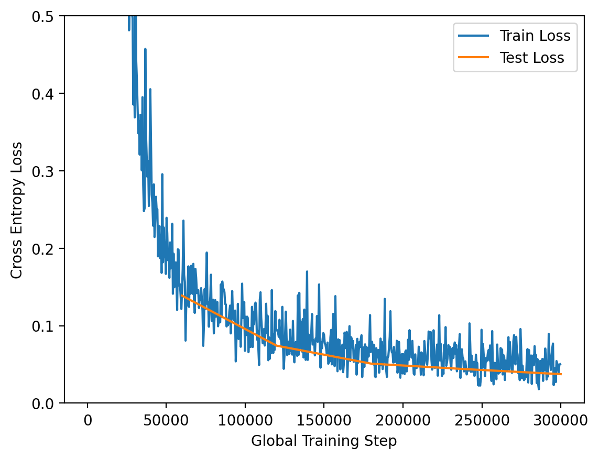
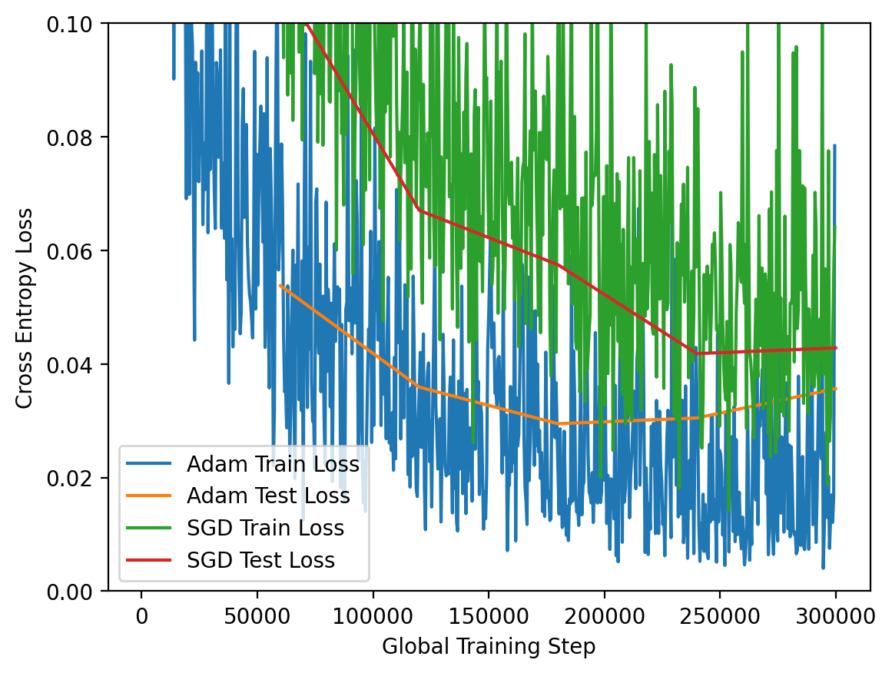
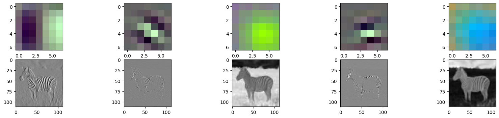
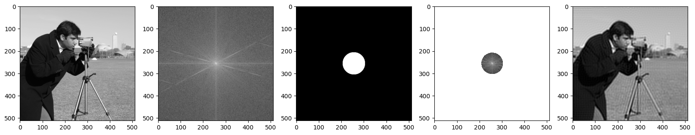
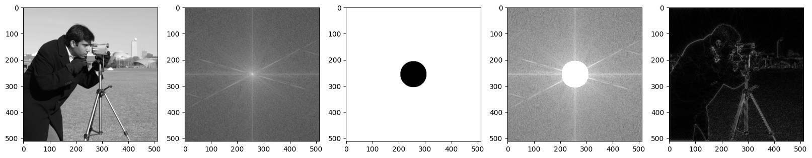
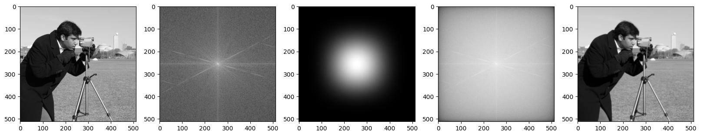
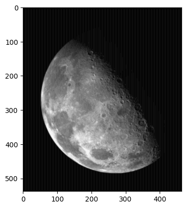
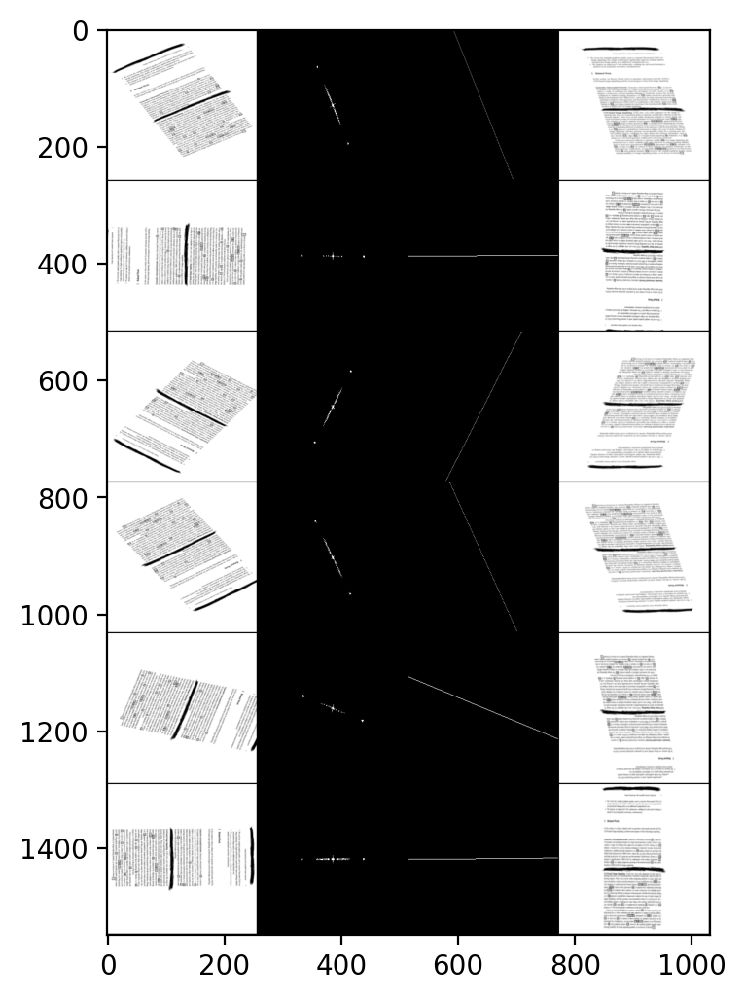

# Image Processing 2

- [Image Processing 2](#image-processing-2)
  - [Task 1](#task-1)
    - [Subtask a](#subtask-a)
    - [Subtask b](#subtask-b)
    - [Subtask c](#subtask-c)
    - [Subtask d](#subtask-d)
    - [Subtask e](#subtask-e)
  - [Task 2](#task-2)
    - [Subtask a](#subtask-a-1)
    - [Subtask b](#subtask-b-1)
    - [Subtask c](#subtask-c-1)
    - [Subtask d](#subtask-d-1)
  - [Task 3](#task-3)
    - [Subtask a](#subtask-a-2)
    - [Subtask b](#subtask-b-2)
    - [Subtask c](#subtask-c-2)
  - [Task 4](#task-4)
    - [Subtask a](#subtask-a-3)
    - [Subtask b](#subtask-b-3)
    - [Subtask c](#subtask-c-3)
    - [Subtask d](#subtask-d-2)

## Task 1

### Subtask a

Given that the kernel size is $7\times7$ with a stride of 1, if we want to have the output shape the same height and width as the input shape then the padding should be set to $3$

### Subtask b

The input shape is $512\times512$. The output shape of the first cnovolutionnal layer is $506\times506$. Assuming no padding, square kernels and a stride of 1, this means that the kernel size is:

$$K_W=K_H=(512+2*0)/1+1-506=7$$

Since there are 12 feature maps in the first layer, we can conclude that the first layer has the following parameters:

- Kernel size : $7\times7$
- Stride : $1$
- Padding : $0$
- Number of filters : $12$

### Subtask c

We now perform a subsampling of neighborhood $2\times2$ with a stride of 2. This means that the image dimensions will be divided by 2. Assuming that the input image has dimensions $506\times506$, the output image will have dimensions $253\times253$

### Subtask d

Now the input shape is $253\times253$ and we use $3\times3$ kernels with no padding and a stride of 1. The output shape will be :

$$W=H = (253-3+2\times0)+1=251$$

### Subtask e

Assuming the input shape is $32\times 32\times 1$

- Layer 1: Conv2D (kernel size=5, stride=1, padding=2)
  - $n_{params}=32\times\big(\underbrace{(5\times5\times1)}_\text{weights}+\underbrace{1\vphantom{)}}_\text{bias}\big)=832$
  - output dim : $W=H= (32-5+2\times 2)/1+1 = 32$
  - output shape:$(W=32,H=32,C=32)$

- Layer 2: MaxPool2D (kernel size=2, stride=2) 
  - $n_{params}=0$
  - output dim : $W=H= 32/2 = 16$
  - output shape:$(W=16,H=16,C=32)$

- Layer 3: Conv2D (kernel size=3, stride=1, padding=1) 
  - $n_{params}=64\times\big(\underbrace{(3\times3\times32)}_\text{weights}+\underbrace{1\vphantom{)}}_\text{bias}\big)=18496$
  - output dim : $W=H= (16-3+2\times 1)/1+1 = 16$
  - output shape:$(W=16,H=16,C=64)$

- Layer 4: MaxPool2D (kernel size=2, stride=2) 
  - $n_{params}=0$
  - output dim : $W=H= 16/2 = 8$
  - output shape:$(W=8,H=8,C=64)$
  
- Layer 5: Conv2D (kernel size=3, stride=1, padding=1) 
  - $n_{params}=128\times\big(\underbrace{(3\times3\times64)}_\text{weights}+\underbrace{1\vphantom{)}}_\text{bias}\big)=73856$
  - output dim : $W=H= (8-3+2\times 1)/1+1 = 8$
  - output shape:$(W=8,H=8,C=128)$

- Layer 6: MaxPool2D (kernel size=2, stride=2) 
  - $n_{params}=0$
  - output dim : $W=H= 8/2 = 4$
  - output shape:$(W=4,H=4,C=128)$

- Layer 7: Flatten
  - $n_{params}=0$
  - output shape:$(W=1,H=2048,C=1)$
  
- Layer 8: FullyConnected
    - $n_{params}=64\times\big(\underbrace{2048}_\text{input}+\underbrace{1}_\text{bias}\big)=131136$
    - output shape:$(W=1,H=64,C=1)$

- Layer 9: FullyConnected
    - $n_{params}=10\times\big(\underbrace{64}_\text{input}+\underbrace{1}_\text{bias}\big)=650$
    - output shape:$(W=1,H=10,C=1)$

Hence, the total number of learnable parameters is:

$$\text{total parameters}=\sum_{layers}n_{params}=224970$$

## Task 2

### Subtask a

Final Test loss: 0.03748996451569003. Final Test accuracy: 0.9879

There is no evidence of overfitting as the train loss and test loss mostly overlap on the graph.

### Subtask b

Final Adam Test loss: 0.03565496312053169. Final Adam Test accuracy: 0.9856

Final SGD Test loss: 0.042829393994049794. Final SGD Test accuracy: 0.9856

### Subtask c

### Subtask d

1. Detects vertical edges
2. Detects diagonal edges
3. Detects flat green areas
4. Detects horizontal edges
5. Detects flat blue areas

## Task 3

### Subtask a

- 1a → 2e
- 1b → 2c
- 1c → 2f
- 1d → 2b
- 1e → 2d
- 1f → 2a

If the frequency is around the horizontal axis, the points are also going to be spread arount the horizontal axis in the frequency domain. Additionally, The closer the points are together, the lower the frequency is in the spacial domain.

### Subtask b

Low-pass filters cut off high frequencies, high-pass filter cut off low frequencies

### Subtask c

*a* is a high-pass filter, *b* is a low-pass filter. *b* must be a low-pass filter because only the center of the image is white. Since this is the center of the frequency domain, only low frequencies reside here. As a result, the other one is a high-pass filter for similar reasons. 

## Task 4

### Subtask a

### Subtask b

### Subtask c

### Subtask d

