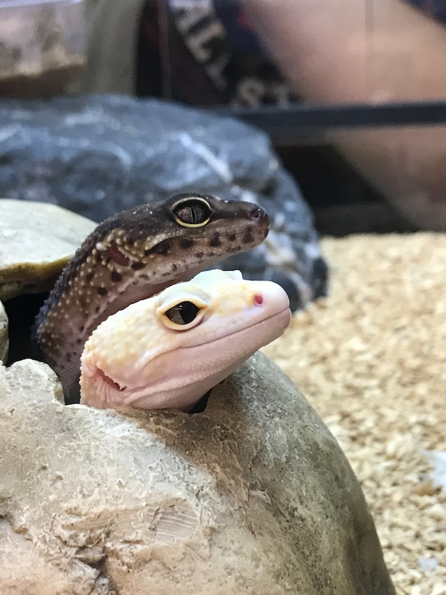

# Image Processing 3

- [Image Processing 3](#image-processing-3)
  - [Task 1](#task-1)
    - [Subtask 1a](#subtask-1a)
    - [Subtask 1b](#subtask-1b)
    - [Subtask 1c](#subtask-1c)
    - [Subtask 1d](#subtask-1d)
    - [Subtask 1e](#subtask-1e)
  - [Task 2](#task-2)
    - [Subtask 2a](#subtask-2a)
    - [Subtask 2b](#subtask-2b)
  - [Task 3](#task-3)
    - [Subtask 3a](#subtask-3a)
    - [Subtask 3b](#subtask-3b)
    - [Subtask 3c](#subtask-3c)

## Task 1

### Subtask 1a

AAAAAAAAAAAAAa

### Subtask 1b

AAAAAAAAAAAAAa

### Subtask 1c

AAAAAAAAAAAAAa

### Subtask 1d

AAAAAAAAAAAAAa

### Subtask 1e

AAAAAAAAAAAAAa

## Task 2

### Subtask 2a

AAAAAAAAAAAAAa

### Subtask 2b

AAAAAAAAAAAAAa

## Task 3

### Subtask 3a

AAAAAAAAAAAAAa

### Subtask 3b

AAAAAAAAAAAAAa

### Subtask 3c

AAAAAAAAAAAAAa

