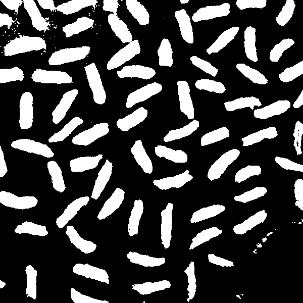
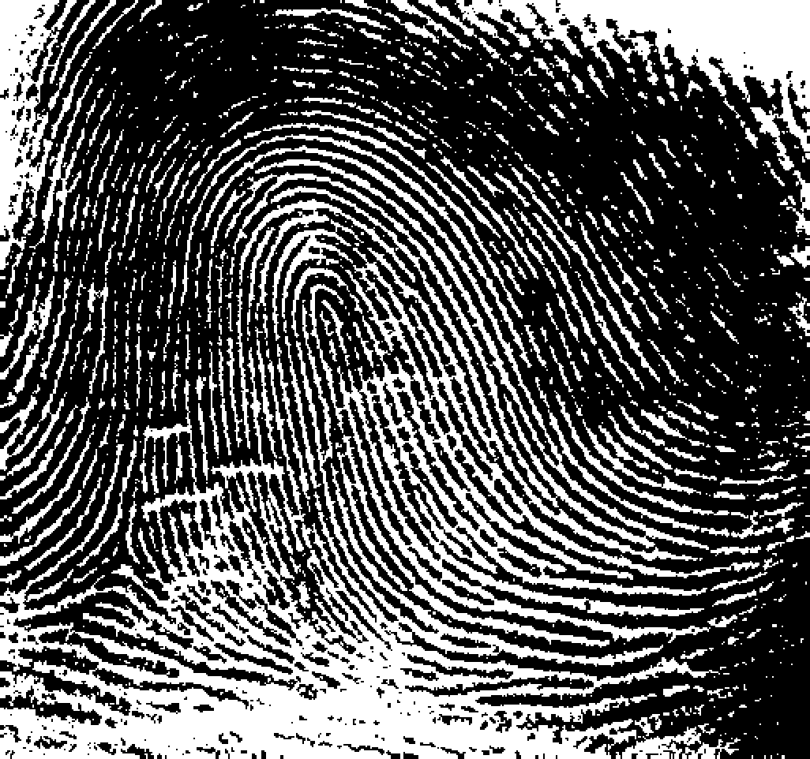
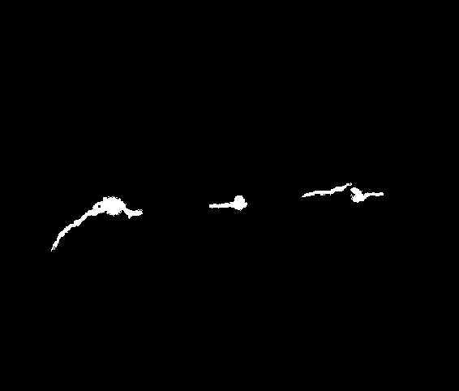

# Image Processing 3

- [Image Processing 3](#image-processing-3)
  - [Task 1: Theory](#task-1-theory)
    - [Subtask 1a](#subtask-1a)
    - [Subtask 1b](#subtask-1b)
    - [Subtask 1c](#subtask-1c)
    - [Subtask 1d](#subtask-1d)
    - [Subtask 1e](#subtask-1e)
  - [Task 2: Segmentation](#task-2-segmentation)
    - [Subtask 2a](#subtask-2a)
    - [Subtask 2b](#subtask-2b)
  - [Task 3](#task-3)
    - [Subtask 3a](#subtask-3a)
    - [Subtask 3b](#subtask-3b)
    - [Subtask 3c](#subtask-3c)

## Task 1: Theory

### Subtask 1a

**Opening** is a combination of *erosion* followed by *dilation*.

Erosion is applied to the image first, which erodes away the boundaries of objects in the image. Then, dilation is performed, which expands the remaining regions but not to the extent of the original size. It smoothes contours, breaks narrow bridges, eliminates small protrusions, and separates touching objects.

Applying opening operations successively tends to remove finer details, smaller objects, and finer structures in the image. It keeps eliminating smaller elements and smoothing contours with each iteration.

**Closing** is a combination of *dilation* followed by *erosion*.

Dilation is applied first, which expands the boundaries of objects in the image. Then, erosion is performed, which reduces the size of the expanded regions but not to the extent of the original size. It fills small holes, joins broken contours, and fuses nearby objects.

Successive closing operations tend to fill in smaller holes, bridges small gaps between objects, and merge closer objects. Each iteration tends to result in more significant connectivity between nearby structures.


### Subtask 1b

The main goal of smoothing is to reduce the impact of noise and irregularities between pixel values. It usually involves a low-pass filter that helps to enhance actual edges by reducing the high-frequency components in the image.

Real edges represent significant changes in pixel intensity, and smoothing can highlight these changes by reducing the effect of minor fluctuations in intensity, ensuring that the detected edges represent actual features in the image.

### Subtask 1c

Hysteresis thresholding involves the utilization of two thresholds: a high and a low threshold.

Initially, pixels with intensity gradient magnitudes above the high threshold are classified as edge pixels, while those below the low threshold are dismissed as non-edge pixels.

Pixels exhibiting gradient magnitudes between these thresholds are examined for their connectivity to confirmed edge pixels. If a pixel (between the thresholds) is connected to an established edge pixel (above the high threshold) through neighboring pixels, it is also marked as an edge pixel.


### Subtask 1d

The dual thresholding strategy creates a "hysteresis" effect (a "memory" effect), ensuring weaker edges connected to stronger edge structures are retained while filtering out isolated noise responses.

This approach of double thresholding is more robust to changes in noise and in edge strength than a single threshold. It allows to have a better edge continuity while ensuring a reduction of false positives. 

### Subtask 1e

To perform the dilation of the given image by the given structuring element, we need to place the center of the structuring element $B$ over each `1` pixel in the image. Then, expand the `1` pixels of the image $A$ based on the structuring element by setting the pixels above and below to `1` accordingly.

We get the following image
```
0	1	1	1	1	1	0
1	1	1	1	1	1	1
1	1	1	0	1	1	1
1	0	1	0	1	0	1
1	1	1	0	1	1	1
1	1	1	1	1	1	1
0	1	1	1	1	1	0
```


## Task 2: Segmentation

### Subtask 2a





### Subtask 2b



## Task 3

### Subtask 3a


### Subtask 3b

AAAAAAAAAAAAAa

### Subtask 3c

AAAAAAAAAAAAAa

<div style="break-after:page"></div>
